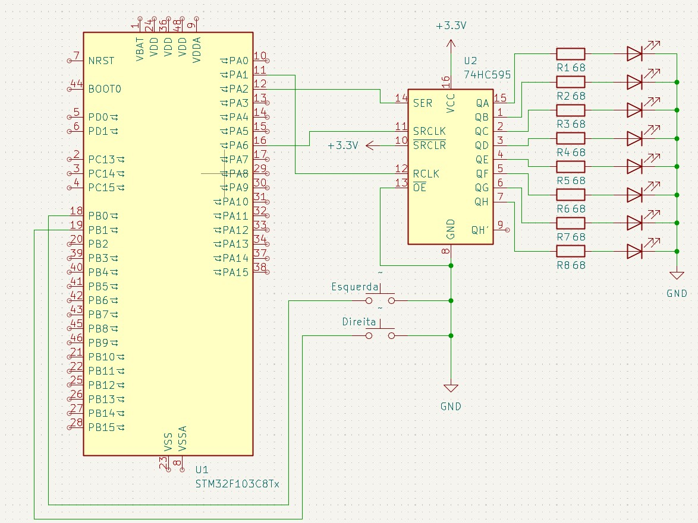
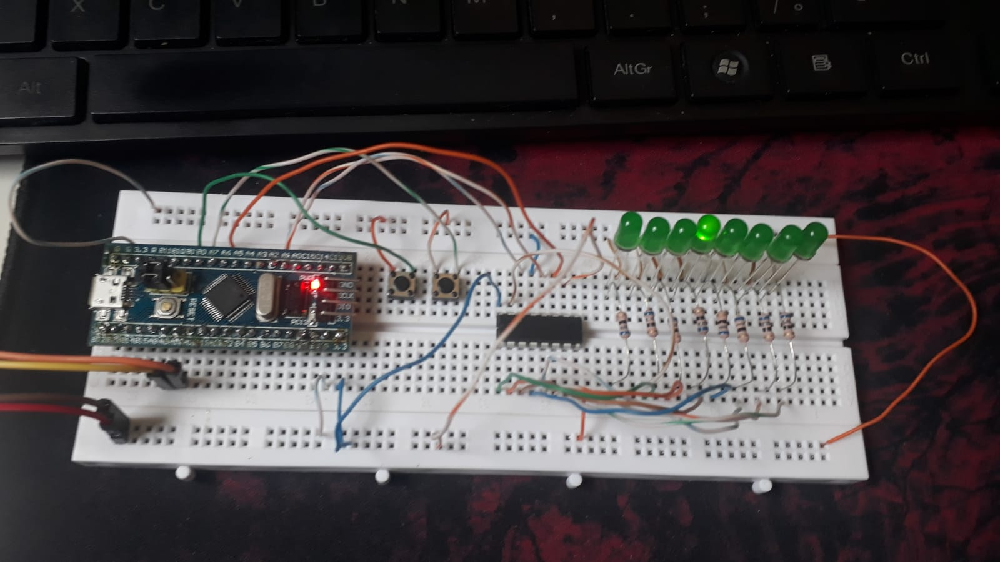

# SHIFT LED

Este projeto consiste em mudar o LED que está atualmente aceso utilizando dois botões para movê-lo para a esquerda ou para a direita.

## Funcionamento

Vídeo de referência: [YouTube](https://youtube.com/shorts/YSDwbrjQ-3A?feature=share)

O circuito possui 8 LEDs, que se alternam entre o que está aceso no momento. No início, apenas um LED fica aceso.

Para alterar o LED que está aceso, utilizam-se os dois botões presentes: o botão ligado à porta B1 move o LED aceso para a esquerda, e o botão ligado à porta B0 move o LED aceso para a direita.

Na situação em que o LED mais à direita está aceso e queremos movê-lo para a direita novamente, o LED mais à esquerda será aceso, simulando um efeito de carrossel infinito. O mesmo ocorre na situação em que o LED mais à esquerda está aceso e queremos movê-lo para a esquerda.

## Componentes

- 8x LEDs verdes;
- 8x RES 68 Ω;
- 74HC595;
- 2x Chave Táctil (2 Pinos);
- STM32F103C8T6.

## Montagem

- Esquema do Projeto

- Circuito físico

